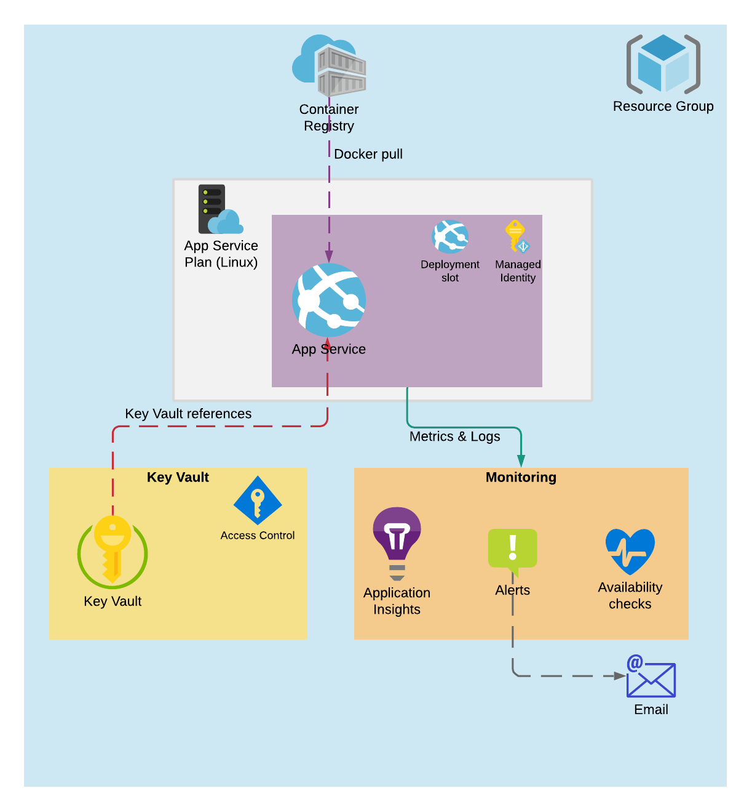

# azure_linux_docker_app_service

This terraform example demonstrates how to create a container based Linux App Service with secret management and monitoring.

## Features

- [Managed identity](https://docs.microsoft.com/en-us/azure/active-directory/managed-identities-azure-resources/overview) for authentication instead of credentials
- [Key vault references](https://docs.microsoft.com/en-us/azure/app-service/app-service-key-vault-references) for accessing secrets from App Service
- Email alerts for errors and failed availability checks
- Random suffix for resources requiring globally unique name

## Azure services



### [Azure Container Registry](https://azure.microsoft.com/en-us/services/)

For storing container images

- App Service pulls the image from the registry during deployment
- Authentication using managed identity

### [Key Vault](https://azure.microsoft.com/en-us/services/key-vault/)

For storing and accessing secrets

- Access management using access policies

### App Service plan & [App Service](https://azure.microsoft.com/en-us/services/app-service/)

For hosting the application. App Service is created into the plan. If you have multiple App Services, it is possible to share the same plan among them.

- The application's docker image is deployed from the container registry
- Managed identity for accessing the Key Vault & Container registry
- Deployment slot for high availability deploys
- App service has a lot of settings that can be configured. See all of them [here](https://github.com/projectkudu/kudu/wiki/Configurable-settings).

### [Application Insights](https://docs.microsoft.com/en-us/azure/azure-monitor/app/app-insights-overview)

User for monitoring, metrics, logs and alerts.

- The application should use Application Insights library (e.g. for [Node.js](https://www.npmjs.com/package/applicationinsights)) to instrument the application and integrate it with App Insights
- Includes availability checks from multiple locations
- Email alert for:
  - Failed availability checks
  - Responses with 5xx response code
  - Failed dependencies (e.g. database query or HTTP request fails)

## Example usage

Prerequisites

- Azure account and a service principal
- Resource group
- Terraform [Azure Provider](https://www.terraform.io/docs/providers/azurerm/) set up

```tf
module "my_app" {
  # Required
  resource_group_name = "my-resource-group"
  alert_email_address = "example@example.com"

  # Optional (with their default values)
  name_prefix            = "azure-app-example--"
  app_service_name      = "appservice"
  app_insights_app_type = "other"
  app_service_plan_tier = "PremiumV2"
  app_service_plan_size = "P1v2"
}
```

We can create rest of the resources with `terraform apply`.

An example of a Node.js application can be found in `./example-app` directory.

## Building an image and deploying to the App Service

- [Using Github actions](https://docs.microsoft.com/en-us/azure/app-service/deploy-container-github-action)
- [Using Azure DevOps pipelines](https://docs.microsoft.com/en-us/azure/devops/pipelines/tasks/deploy/azure-rm-web-app-containers?view=azure-devops)

## Inputs

| Name                  | Description                                                                                                         |  Type  |         Default         | Required |
| --------------------- | ------------------------------------------------------------------------------------------------------------------- | :----: | :---------------------: | :------: |
| resource_group_name   | Name of the resource group where the resources are deployed                                                         | string |                         |   yes    |
| alert_email_address   | Email address where alerts are sent                                                                                 | string |                         |   yes    |
| name_prefix           | Name prefix to use for objects that need to be created (only lowercase alphanumeric characters and hyphens allowed) | string | `"azure-app-example--"` |    no    |
| app_service_name      | Name of the app service to be created. Must be globally unique                                                      | string |     `"appservice"`      |    no    |
| app_insights_app_type | Application insights application type                                                                               | string |        `"other"`        |    no    |
| app_service_plan_tier | App service plan tier                                                                                               | string |      `"PremiumV2"`      |    no    |
| app_service_plan_size | App service plan size                                                                                               | string |        `"P1v2"`         |    no    |
