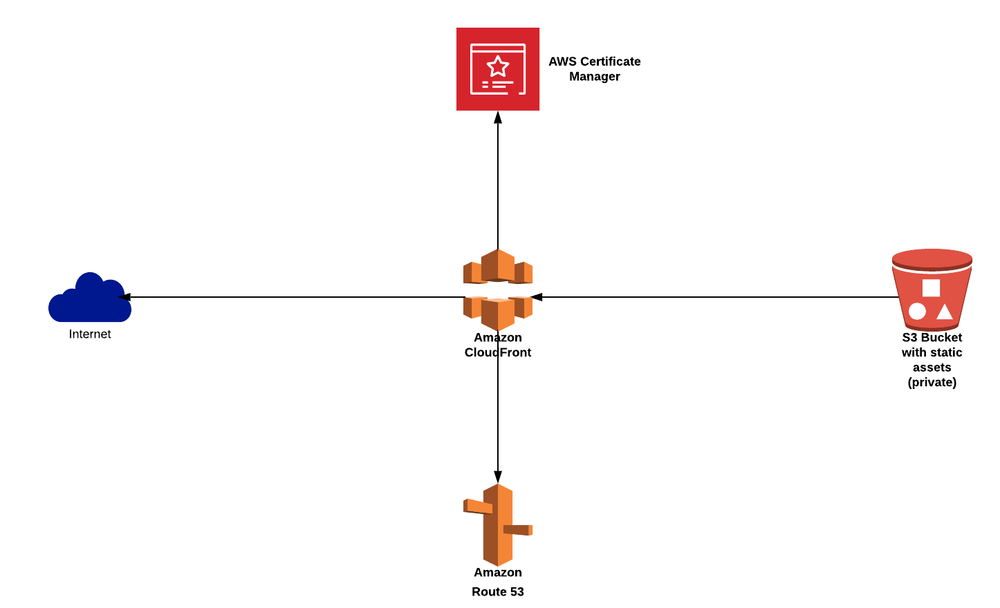

# Static website hosted using S3 and cloudfront with SSL support

Hosting static website using S3 is a very cost effective approach. Since, S3 website does not support SSL certificate, we use cloudfront for the same. In this example, we host the contents in a private S3 bucket which is used as the origin for cloudfront. We use cloudfront Origin-Access-Identity to access the private content from S3.

## Architecture

